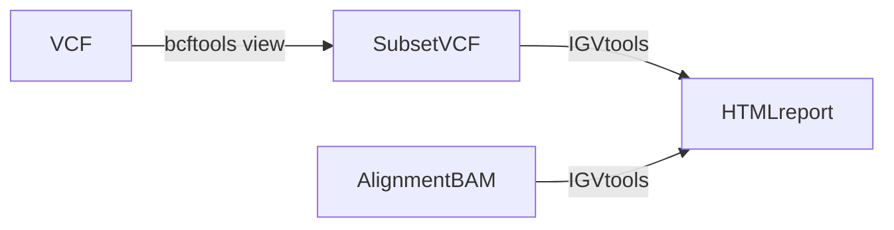

# IGVreport-nf 

- [Description](#description)
  - [Diagram](#diagram)
  - [User guide](#user-guide)
  - [Workflow summaries](#workflow-summaries)
      - [Metadata](#metadata)
      - [Component tools](#component-tools)
      - [Required (minimum)
        inputs/parameters](#required-minimum-inputsparameters)
  - [Additional notes](#additional-notes)
  - [Help/FAQ/Troubleshooting](#helpfaqtroubleshooting)
  - [Acknowledgements/citations/credits](#acknowledgementscitationscredits)

## Description 

Quickly generate [IGV `.html` reports](https://github.com/igvteam/igv-reports) for a genomic region of interest in the human genome (hg38). Bcftools is used to subset a VCF to a region of interest, the subset VCF is then passed to IGV-reports, which generates a report consisting of a table of genomic sites or regions and associated IGV views for each site. The reports can be opened by any web browser as a static page.  

### Diagram 



### User guide

This workflow uses containers for all steps and can run using Singularity or Docker. It requires Nextflow and either Singularity or Docker be installed. For instructions on installing Nextflow, see their [documentation](https://www.nextflow.io/docs/latest/getstarted.html).

**This workflow currently only generates reports for the human reference genome assembly, Hg38.** 

The workflow runs three processes: 
1. The provided VCF file is subset to a region of interest using Bcftools view 
2. The Subset VCF file is then indexed using Bcftools index 
3. The subset VCF and provided Bam file are used to generate the html report for the region of interest. 

To start clone this repository: 
```
git clone https://github.com/Sydney-Informatics-Hub/IGVreport-nf.git
```

From the IGVreport-nf directory, run the pipeline: 
```
nextflow run main.nf --sample <sampleID> \
    --bam <path/to/bam> \
    --vcf <path/to/vcf> \
    --chr <chrID> --start <begin bp> --stop <end bp>     
```

This will create a report in a directory titled `./Report`. You can rename this directory at runtime using the flag `--outDir`. All runtime summary reports will be available in the `./runInfo` directory.  

### Workflow summaries

#### Metadata 

|metadata field     | workflow_name / workflow_version  |
|-------------------|:---------------------------------:|
|Version            | 1.0                               |
|Maturity           | under development                 |
|Creators           | Georgie Samaha                    |
|Source             | NA                                |
|License            | GPL-3.0 license                   |
|Workflow manager   | NextFlow                          |
|Container          | None                              |
|Install method     | NA                                |
|GitHub             | github.com/Sydney-Informatics-Hub/IGVreport-nf    |
|bio.tools 	        | NA                                |
|BioContainers      | NA                                | 
|bioconda           | NA                                |

#### Component tools

* nextflow>=20.07.1
* singularity or docker
* bcftools/1.16
* igv-reports/1.6.1

#### Required (minimum) inputs/parameters

* An indexed alignment file in Bam format 
* A gzipped and indexed vcf file

## Additional notes

## Help/FAQ/troubleshooting 

## Acknowledgements/citations/credits

This workflow was developed by the Sydney Informatics Hub, a Core Research Facility of the University of Sydney and the Australian BioCommons which is enabled by NCRIS via Bioplatforms Australia. 
